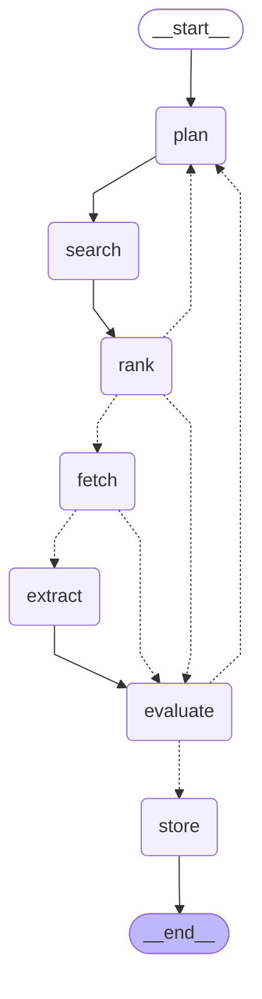

# Discovery pipeline

Generated by `scripts/draw_graph.py` — regenerate after changing the graph.

| Step | Job | Reaches out to |
|---|---|---|
| `plan` | write the search queries | model |
| `search` | run the queries not yet run, in two waves | Tavily |
| `rank` | order the pool best-first, choose sites and say why | model, Mongo |
| `fetch` | get the pages for **one** site | Firecrawl, model |
| `extract` | read **one** site, build and check its records | model |
| `evaluate` | judge each record against the profile | model |
| `store` | write each record once, with its verdict | Mongo |

`fetch` and `extract` run once per site, in parallel. `evaluate` is the single fan-in, which is why the re-plan decision lives there.

