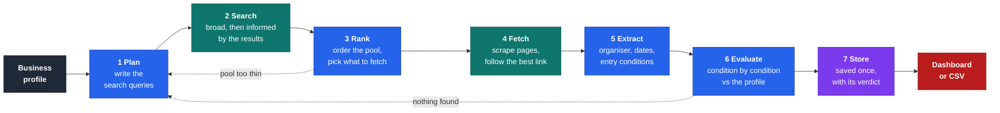

# Proposed solution - pipeline flow

```mermaid
flowchart LR
    P["<b>Business<br/>profile</b>"]:::src
    A1["<b>1 Plan</b><br/>write the<br/>search queries"]:::ai
    A2["<b>2 Search</b><br/>broad, then informed<br/>by the results"]:::tool
    A3["<b>3 Rank</b><br/>order the pool,<br/>pick what to fetch"]:::ai
    B1["<b>4 Fetch</b><br/>scrape pages,<br/>follow the best link"]:::tool
    B2["<b>5 Extract</b><br/>organiser, dates,<br/>entry conditions"]:::ai
    B3["<b>6 Evaluate</b><br/>condition by condition<br/>vs the profile"]:::ai
    B4["<b>7 Store</b><br/>saved once,<br/>with its verdict"]:::det
    O["<b>Dashboard<br/>or CSV</b>"]:::out

    P --> A1 --> A2 --> A3 --> B1 --> B2 --> B3 --> B4 --> O
    A3 -.->|"pool too thin"| A1
    B3 -.->|"nothing found"| A1

    classDef src fill:#1f2937,stroke:#111827,color:#fff
    classDef ai fill:#2563eb,stroke:#1e40af,color:#fff
    classDef tool fill:#0f766e,stroke:#115e59,color:#fff
    classDef det fill:#7c3aed,stroke:#5b21b6,color:#fff
    classDef out fill:#b91c1c,stroke:#7f1d1d,color:#fff
```
